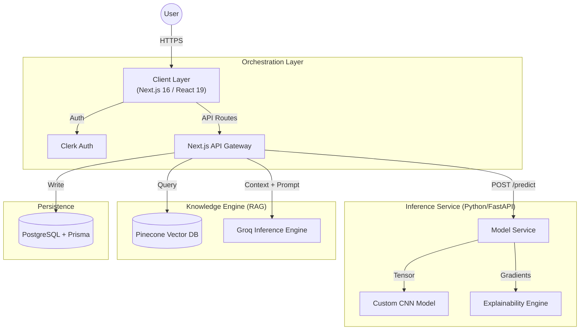

# HistoPath

   

> **HistoPath** is a full-stack diagnostic support system capable of detecting metastatic cancer in lymph node sections. It combines a custom **CNN inference engine** for binary classification with a **RAG-powered AI assistant** to provide explainable, context-aware clinical insights.

---

## System Architecture

The system uses a decoupled architecture to separate ML inference from the application logic.

### Key Design Decisions
- **Hybrid Compute**: Heavy image processing is handled by a Python/FastAPI service, keeping the Next.js UI responsive.
- **Explainable AI**: Grad-CAM visualizes which tissue regions influenced the prediction, helping users understand the model's logic.
- **Context-Aware Assistant**: The AI assistant uses RAG to ground its answers in real-time analysis data, reducing hallucinations.

## Key Features

- **Metastasis Detection**: High-precision classification of tissue patches from the PCam dataset.
- **Interactive Heatmaps**: Overlay heatmaps on slides to localize potential tumor regions.
- **Clinical Assistant**: Chatbot that explains predictions and interprets confidence scores.
- **Secure History**: Saves analysis sessions and chat logs for future reference.

## Tech Stack

| Component            | Technology              | Description                                        |
| :------------------- | :---------------------- | :------------------------------------------------- |
| **Frontend**         | Next.js 16 (App Router) | Server-side rendering, React 19, Tailwind CSS.     |
| **Inference API**    | Python / FastAPI        | Async handling of model prediction requests.       |
| **ML Core**          | TensorFlow / Keras      | Custom CNN architecture trained on PCam.           |
| **Image Processing** | OpenCV / Pillow         | Preprocessing and heatmap superposition.           |
| **Database**         | PostgreSQL + Prisma     | Relational data storage with type safety.          |
| **Auth**             | Clerk                   | Secure user authentication and session management. |
| **LLM / RAG**        | Groq SDK + Pinecone     | Low-latency inference and semantic search.         |

## Dataset & Model
The model detects metastatic vs. non-metastatic tissue using the **PatchCamelyon (PCam)** dataset (>280k scans).

> **Disclaimer**: For research use only. Not for professional medical diagnosis.

## Contributing
Contributions to the CNN architecture or UI are welcome. Please open an issue or PR.

## License
MIT License. See [LICENSE](LICENSE) for more information.

